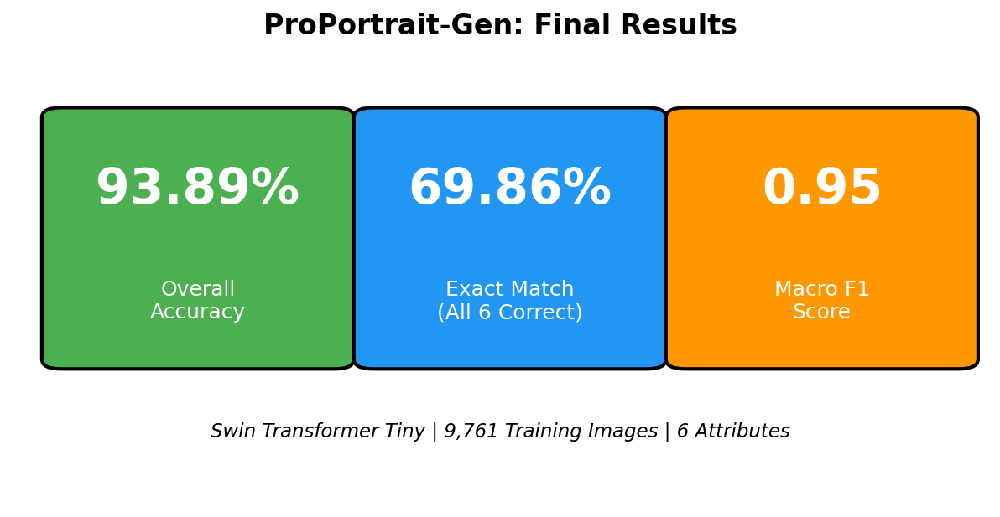
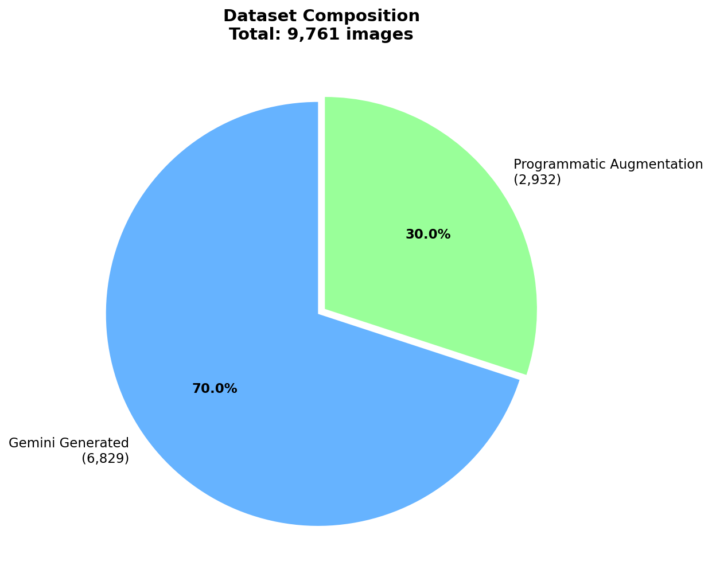
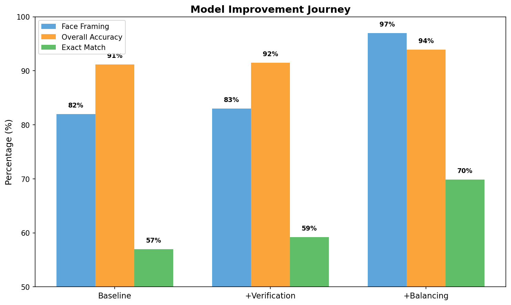

# ProPortrait-Gen

**Automated Professional Portrait Quality Assessment using Synthetic Data and Vision Transformers**

## Project Motivation & Problem Statement

LinkedIn and corporate headshots require specific quality standards, but:
- Manual review is time-consuming and subjective
- No existing labeled datasets exist for professional portrait attributes
- Generative AI models struggle to follow negative prompts reliably

**Solution:** Build a multi-label classification model that automatically evaluates 6 quality attributes of professional portrait photos using synthetically generated training data.

## Visual Abstract



```
FFHQ Images          Gemini API           Label Verification      Final Dataset
(HuggingFace)   -->  Generation      -->  (OpenCV Face Detection) --> 9,761 images
                     6,829 images         Fixed 2,319 mislabeled
                                                    |
                                                    v
                                          Programmatic Augmentation
                                          +2,932 bad-framing images
```



**Input:** A single headshot image (224x224)

**Output:** 6 binary attributes:
| Attribute | Professional (1) | Degraded (0) |
|-----------|------------------|--------------|
| Lighting Even and Frontal | Balanced illumination | Harsh shadows |
| Background Clean and Non-Distracting | Plain/neutral | Cluttered/distracting |
| Business or Professional Attire Visible | Formal clothing | Casual/inappropriate |
| Neutral Professional Facial Expression | Calm/neutral | Exaggerated emotion |
| Face Properly Framed and Centered | Balanced composition | Off-center framing |
| Image Sharpness High | Crisp focus | Blurry/soft |

## Datasets

### Source Dataset
- **FFHQ** (Flickr-Faces-HQ): 70,000 high-quality face images
- Streamed from HuggingFace Hub ([`marcosv/ffhq-dataset`](https://huggingface.co/datasets/marcosv/ffhq-dataset))

### Generated Dataset

**Download:** [Google Drive](https://drive.google.com/drive/folders/169_Y7wz-S8kiTq8QCl7sdcBnA-Y-M-5k?usp=sharing)

- **6,829 synthetic portraits** generated via Google Gemini API
- **2,932 programmatic augmentations** for bad framing
- **Final size: 9,761 labeled images**

After downloading, place contents in `output/`:
```
output/
├── images/    # 9,761 JPEG images (512x512)
└── metadata/  # JSON metadata per image
```

## Data Augmentation & Generation Methods

### Synthetic Generation Pipeline
1. Stream FFHQ images from HuggingFace
2. Generate label vectors using three-bucket distribution:
   - 15% Perfect (all 1s)
   - 15% Near-perfect (exactly one 0)
   - 70% Mixed random
3. Build prompts with 4 phrasings per attribute + 10% dropout
4. Generate via Gemini API with deterministic seeds

### Programmatic Augmentation
Generators ignore negative prompts (~83% failure rate for "bad framing"). We solved this with:

**Sharpness (100% accuracy):**
- Generate sharp image, save with `sharpness=1`
- Apply blur (gaussian/motion/defocus/downscale), save with `sharpness=0`

**Framing (97% accuracy after balancing):**
- Generate well-framed image, save with `framing=1`
- Apply bad framing transforms, save with `framing=0`:
  - Off-center (left/right/top)
  - Extreme close-up
  - Too far (subject small in frame)
  - Head cutoff

### Label Verification
OpenCV face detection automatically fixed 2,319 mislabeled images (82.8% of "bad framing" labels were actually good).

## Input/Output Examples

### Label Vector Format
Each image filename encodes its 6 binary labels: `ffhq_00001_011111.jpg`

| Label Code | Meaning |
|------------|---------|
| `111111` | Perfect - all attributes good |
| `011111` | Bad Lighting only |
| `101111` | Bad Background only |
| `110111` | Bad Attire only |
| `111011` | Bad Expression only |
| `111101` | Bad Framing only |
| `111110` | Bad Sharpness only |

### Programmatic Bad Framing Types
| Type | Description |
|------|-------------|
| Off-Center Left | Face pushed to right, left side cropped |
| Off-Center Right | Face pushed to left, right side cropped |
| Extreme Close-up | Only part of face visible |
| Too Far | Subject too small, lost in frame |
| Head Cutoff | Top of head cropped |

See `visuals/viz_good_vs_bad_framing.png` for visual examples.

## Models and Pipelines

### Architecture
- **Model:** Swin Transformer Tiny (28M parameters)
- **Pretrained:** ImageNet
- **Classification Heads:** 6 independent binary heads
- **Input Size:** 224 x 224 pixels

### Data Pipeline
```
FFHQ Images --> Label Generator --> Prompt Builder --> Gemini API --> Output Manager
                    |                    |               |              |
               Three-bucket         Variation +      Async +        JPEG +
               distribution         dropout          retry          normalize
```

## Training Process and Parameters

| Parameter | Value |
|-----------|-------|
| Model | Swin Transformer Tiny |
| Input Size | 224 x 224 |
| Batch Size | 32 |
| Epochs | 10 |
| Optimizer | AdamW (lr=5e-5) |
| Scheduler | OneCycleLR (max_lr=1e-4) |
| Loss | BCEWithLogitsLoss |
| Train/Val Split | 80/20 (GroupShuffleSplit) |

## Metrics

### Overall Performance
| Metric | Value |
|--------|-------|
| Overall Accuracy | **93.89%** |
| Exact Match (all 6 correct) | **69.86%** |
| Macro F1 | **0.95** |

### Per-Attribute Accuracy
| Attribute | Accuracy | F1 Score |
|-----------|----------|----------|
| Image Sharpness High | 99.5% | 1.00 |
| Face Properly Framed and Centered | 96.7% | 0.97 |
| Business or Professional Attire Visible | 95.1% | 0.95 |
| Background Clean and Non-Distracting | 93.8% | 0.95 |
| Lighting Even and Frontal | 90.3% | 0.92 |
| Neutral Professional Facial Expression | 87.9% | 0.90 |

### Golden Dataset (90 Human-Verified Images)
| Metric | Value |
|--------|-------|
| Overall Accuracy | **97.0%** |
| Exact Match | **83.3%** |
| Macro F1 | **0.982** |

## Results


### Improvement Journey



| Stage | Face Framing | Overall Acc | Exact Match |
|-------|--------------|-------------|-------------|
| Baseline | 82% | 91.2% | 57.0% |
| + Verification | 83% | 91.5% | 59.2% |
| + Balancing | **97%** | **93.9%** | **69.9%** |

### Key Findings
| What We Learned | Implication |
|-----------------|-------------|
| Generators ignore negative prompts | 83% of "bad framing" prompts failed |
| Programmatic augmentation works | Sharpness: 100%, Framing: 97% |
| Label verification is essential | Fixed 2,319 errors automatically |
| Balanced data is critical | Framing improved 82% → 97% after balancing |

## Repository Structure

```
ProPortrait-Gen/
├── README.md                          # This file
├── requirements.txt                   # Python dependencies
│
├── synthetic_dataset_generator.py     # Main data generation pipeline
│
├── notebooks/
│   └── training_and_results.ipynb     # Training + evaluation notebook
│
├── presentations/
│   ├── final/
│   │   ├── Professional Image Classification.pptx
│   │   └── Professional Image Classification.pdf
│   ├── first/                         # Milestone 1 presentation
│   └── 2nd/                           # Milestone 2 presentation
│
├── output/                            # Download from Google Drive (see Datasets)
│   ├── images/                        # Generated images (9,761 JPEGs)
│   ├── metadata/                      # JSON metadata per image
│   └── DOWNLOAD_DATASET.txt           # Download instructions
│
├── results/
│   ├── experiment_results.csv         # Metrics in CSV format
│   └── experiment_results.json        # Metrics in JSON format
│
└── visuals/
    ├── results_summary_card.png           # Final metrics overview
    ├── results_per_attribute_accuracy.png # Accuracy bar chart
    ├── results_improvement_journey.png    # Progress through stages
    ├── results_dataset_composition.png    # Dataset pie chart
    ├── results_training_params.png        # Training config table
    ├── viz_label_distribution.png         # Dataset label distribution
    └── viz_good_vs_bad_framing.png        # Framing examples
```

## Installation

```bash
pip install -r requirements.txt
```

### Dependencies
- `pillow` - Image processing
- `google-genai` - Google GenAI SDK (Gemini API)
- `numpy` - Blur kernel computation
- `datasets` - HuggingFace datasets library
- `torch` - PyTorch for model training
- `timm` - Swin Transformer implementation
- `opencv-python` - Face detection for label verification

## Usage

### Generate Synthetic Dataset
```bash
# Mock mode (testing)
python synthetic_dataset_generator.py -o ./output --mock --limit 100

# Production with Gemini API
python synthetic_dataset_generator.py -o ./output --api_key YOUR_KEY --limit 5000

# High concurrency
python synthetic_dataset_generator.py -o ./output --api_key YOUR_KEY --concurrency 10
```

### Train Model
See `notebooks/training_and_results.ipynb` for the complete training and evaluation pipeline.

## Environment Variables

```bash
export GOOGLE_API_KEY="your-api-key"
# or
export GEMINI_API_KEY="your-api-key"
```

## Team Members

- **Daniel Ziv**
- **Daniel Buts**

## License

This project is for educational purposes.

## Acknowledgments

- FFHQ Dataset: [NVIDIA Research](https://github.com/NVlabs/ffhq-dataset)
- Swin Transformer: [Microsoft Research](https://github.com/microsoft/Swin-Transformer)
- Google Gemini API for image generation
